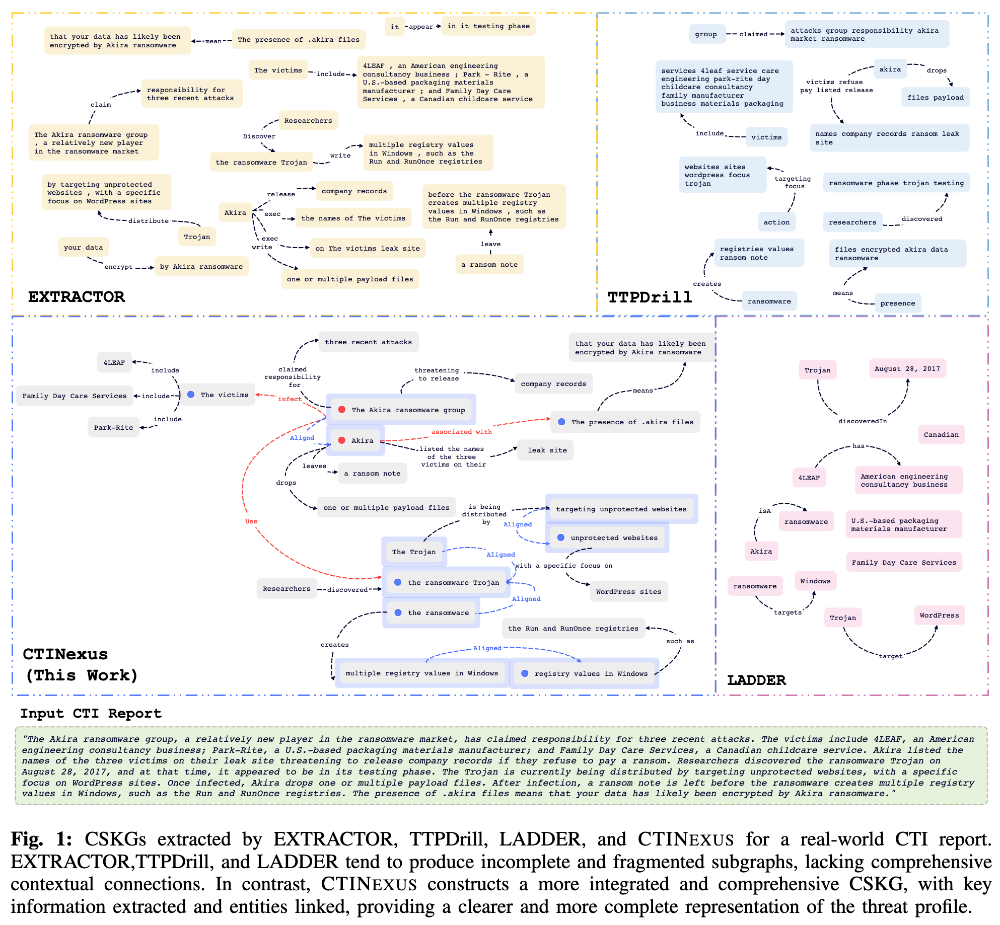

# Knowledge Graph Construction (KGC)

The Knowledge Graph Construction (KGC) module in CTINEXUS consists of three key components: [Entity Typing (ET)]({{site.baseurl}}/docs/kgc/et/), [Entity Merging (EM)]({{site.baseurl}}/docs/kgc/em), and [Link Prediction (LP)]({{site.baseurl}}/docs/kgc/lp). Entity alignment standardizes extracted cybersecurity entities by grouping similar terms under a unified representation to prevent redundancy. Entity merging further refines this process by leveraging semantic similarity measures to consolidate duplicate or closely related entities, enhancing the coherence of the knowledge graph. Finally, link prediction infers missing relationships between entities, ensuring a more complete and interconnected cybersecurity knowledge graph. Together, these modules improve the accuracy, consistency, and utility of the constructed CSKG.
{: .fs-4 .fw-300 }
---

